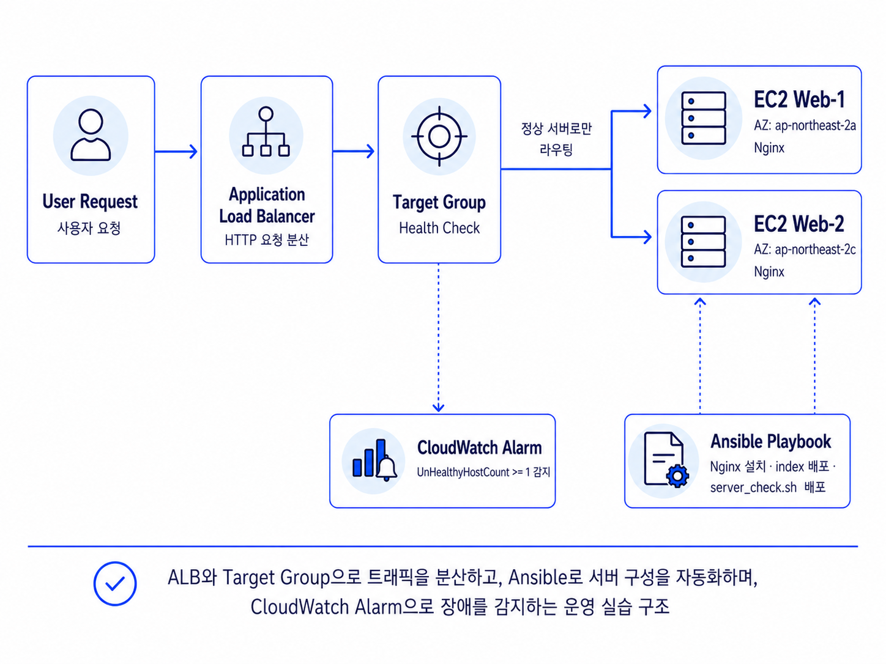
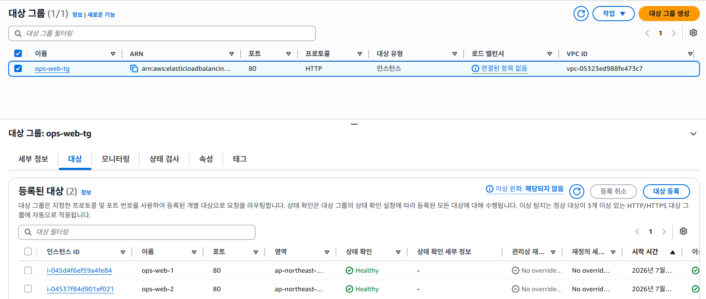
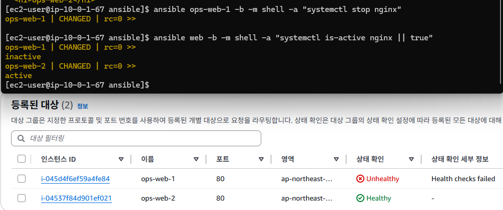
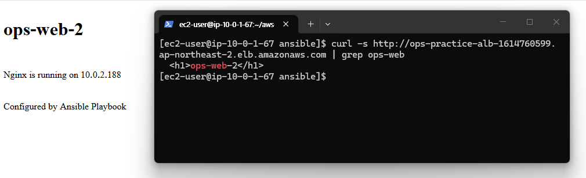
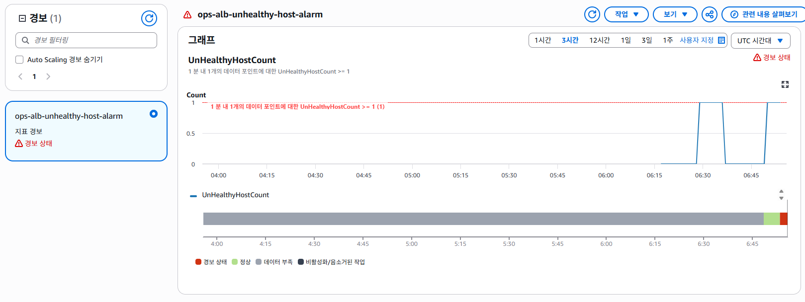

# AWS EC2 기반 Linux 서버 운영 자동화 및 장애 1차 대응 실습

## 1. 프로젝트 개요

이 프로젝트는 AWS 운영 실습 시리즈 1차 프로젝트입니다.

EC2 기반 Linux 서버 2대를 구성하고, Application Load Balancer와 Target Group을 통해 HTTP 요청을 분산하는 구조를 실습했습니다.

또한 Ansible을 사용해 Nginx 설치, index 페이지 배포, 서버 점검 스크립트 배포를 자동화했습니다.

운영 중 발생할 수 있는 장애 상황을 재현하기 위해 EC2 1대의 Nginx 서비스를 중지하고, Target Group Health Check와 CloudWatch Alarm을 통해 장애가 감지되는 흐름을 확인했습니다.

마지막으로 장애 상황에서 어떤 순서로 확인하고 복구해야 하는지 Runbook을 작성하여, 단순 구축이 아니라 운영 관점의 장애 1차 대응 흐름을 정리했습니다.

---

## 2. 프로젝트 목표

- AWS EC2 기반 Linux 서버 운영 구조 이해
- EC2 2대에 Nginx 웹 서버 구성
- Application Load Balancer를 통한 HTTP 요청 분산
- Target Group Health Check를 통한 서버 상태 확인
- Ansible을 활용한 서버 초기 설정 자동화
- Shell Script를 활용한 서버 상태 점검
- Nginx 중지로 장애 상황 재현
- CloudWatch Alarm을 통한 비정상 서버 감지
- Runbook 기반 장애 1차 대응 절차 정리
- 실습 종료 후 리소스 삭제 및 비용 안전 조치 수행

---

## 3. 기술 스택

| 구분 | 기술 |
|---|---|
| Cloud | AWS EC2, VPC, Subnet, Internet Gateway |
| Load Balancing | Application Load Balancer, Target Group |
| Security | Security Group, Key Pair |
| Monitoring | Target Group Health Check, CloudWatch Alarm |
| Automation | Ansible |
| Script | Shell Script |
| OS | Amazon Linux 2023 |
| Web Server | Nginx |
| Tool | PowerShell, SSH, AWS Console |
| Documentation | Markdown, Runbook |

---

## 4. 프로젝트 구조

```text
aws-linux-ops-practice
├─ ansible
│  ├─ ansible.cfg
│  ├─ inventory.ini
│  └─ setup-server.yml
├─ docs
│  ├─ images
│  │  ├─ 00-aws-linux-ops-flow.png
│  │  ├─ 01-target-group-healthy.png
│  │  ├─ 02-alb-nginx-response.png
│  │  ├─ 03-target-group-unhealthy-test.png
│  │  └─ 04-cloudwatch-alarm-unhealthy-host.png
│  └─ runbook.md
├─ scripts
│  └─ server_check.sh
├─ .gitignore
└─ README.md
```

---

## 5. 인프라 구성 흐름



전체 요청 흐름은 다음과 같습니다.

```text
사용자 요청
    ↓
Application Load Balancer
    ↓
Target Group
    ↓
EC2 Web-1 / EC2 Web-2
    ↓
Nginx
```

운영 자동화 흐름은 다음과 같습니다.

```text
Ansible Playbook
    ↓
EC2 Web-1 / EC2 Web-2
    ↓
Nginx 설치, index 페이지 배포, 점검 스크립트 배포
```

장애 감지 흐름은 다음과 같습니다.

```text
Target Group Health Check
    ↓
UnHealthyHostCount 증가
    ↓
CloudWatch Alarm 경보 상태
    ↓
Runbook 기반 장애 1차 대응
```

---

## 6. AWS 네트워크 구성

실습 전용 VPC와 Subnet을 구성하고, EC2 2대와 Application Load Balancer를 같은 네트워크 안에서 연결했습니다.

구성 요약:

```text
VPC
├─ Public Subnet A
│  └─ EC2 Web-1
│
├─ Public Subnet C
│  └─ EC2 Web-2
│
└─ Application Load Balancer
   └─ Target Group
      ├─ EC2 Web-1
      └─ EC2 Web-2
```

이번 1차 실습에서는 Private Subnet이나 Auto Scaling Group은 사용하지 않았습니다.  
해당 구조는 이후 2차 실습에서 Private Subnet, Bastion Host, Auto Scaling Group, Terraform을 활용하여 확장했습니다.

---

## 7. 보안 그룹 구성

### 7.1 ALB Security Group

| Type | Port | Source |
|---|---:|---|
| HTTP | 80 | 0.0.0.0/0 |

ALB는 외부 사용자의 HTTP 요청을 받는 진입점 역할을 합니다.

### 7.2 EC2 Web Security Group

| Type | Port | Source |
|---|---:|---|
| HTTP | 80 | ALB Security Group |
| SSH | 22 | My IP |

EC2 Web 서버는 ALB를 통해 HTTP 요청을 받도록 구성하고, SSH 접속은 운영자 PC에서만 가능하도록 제한했습니다.

---

## 8. Ansible 자동화 구성

Ansible을 사용하여 EC2 Web 서버 2대에 동일한 설정을 자동으로 적용했습니다.

Ansible 구성 파일:

| 파일 | 역할 |
|---|---|
| ansible/ansible.cfg | Ansible 기본 설정 |
| ansible/inventory.ini | 관리 대상 EC2 서버 목록 |
| ansible/setup-server.yml | Nginx 설치 및 서버 설정 자동화 Playbook |

Ansible Playbook에서 수행한 작업은 다음과 같습니다.

```text
Nginx 설치
index.html 배포
Nginx 서비스 실행
Nginx 부팅 시 자동 실행 설정
server_check.sh 점검 스크립트 배포
```

이를 통해 서버를 수동으로 하나씩 설정하지 않고, 동일한 구성을 반복 적용할 수 있도록 했습니다.

---

## 9. 서버 상태 점검 스크립트

`scripts/server_check.sh`는 서버 상태를 빠르게 확인하기 위한 점검 스크립트입니다.

점검 대상:

```text
호스트명
서버 IP
Nginx 서비스 상태
디스크 사용량
메모리 사용량
```

운영자가 장애 상황에서 서버에 접속했을 때, 기본 상태를 빠르게 확인하기 위한 용도로 작성했습니다.

---

## 10. ALB와 Target Group 구성

Application Load Balancer를 구성하고, EC2 Web 서버 2대를 Target Group에 등록했습니다.

요청 흐름:

```text
사용자 요청
    ↓
ALB
    ↓
Listener
    ↓
Target Group
    ↓
EC2 Web-1 / EC2 Web-2
```

Health Check 설정:

| 항목 | 설정 |
|---|---|
| Protocol | HTTP |
| Port | 80 |
| Path | / |
| Success Code | 200 |

Target Group에 등록된 두 EC2가 모두 Healthy 상태인지 확인했습니다.



확인 결과:

```text
ops-web-1: Healthy
ops-web-2: Healthy
```

---

## 11. ALB 접속 확인

ALB DNS로 접속하여 Nginx 웹 페이지가 정상 응답하는지 확인했습니다.



브라우저와 터미널에서 ALB 주소로 요청을 보내고, 응답이 EC2 Web 서버에서 정상적으로 반환되는 것을 확인했습니다.

확인 결과:

```text
ALB DNS 접속 성공
Nginx 페이지 응답 확인
ops-web 응답 확인
```

---

## 12. 장애 재현 및 복구

장애 상황을 재현하기 위해 EC2 Web 서버 1대의 Nginx 서비스를 중지했습니다.

장애 재현 명령 흐름:

```bash
ansible ops-web-1 -b -m shell -a "systemctl stop nginx"
```

이후 Ansible로 Nginx 상태를 확인했습니다.

```bash
ansible web -b -m shell -a "systemctl is-active nginx || true"
```

확인 결과:

```text
ops-web-1: inactive
ops-web-2: active
```

Target Group에서도 ops-web-1은 Unhealthy, ops-web-2는 Healthy 상태로 표시되었습니다.



장애 상황에서도 ALB는 Healthy 상태인 ops-web-2로 요청을 전달하여 서비스가 완전히 중단되지 않는 것을 확인했습니다.

복구는 Nginx 서비스를 다시 시작하는 방식으로 진행했습니다.

```bash
ansible ops-web-1 -b -m shell -a "systemctl start nginx"
```

복구 후 Target Group에서 두 서버가 다시 Healthy 상태로 돌아오는 것을 확인했습니다.

---

## 13. CloudWatch Alarm 구성

Target Group의 비정상 인스턴스 수를 감지하기 위해 CloudWatch Alarm을 구성했습니다.

Alarm 설정:

| 항목 | 값 |
|---|---|
| Alarm Name | ops-alb-unhealthy-host-alarm |
| Metric | UnHealthyHostCount |
| Namespace | AWS/ApplicationELB |
| Condition | UnHealthyHostCount >= 1 |

Nginx 장애를 재현하자 Target Group의 UnHealthyHostCount가 증가했고, CloudWatch Alarm이 경보 상태로 변경되었습니다.



확인 결과:

```text
UnHealthyHostCount >= 1
CloudWatch Alarm 경보 상태 전환
```

---

## 14. Runbook 작성

장애 상황에서 확인해야 할 절차를 문서화하기 위해 Runbook을 작성했습니다.

Runbook 파일:

```text
docs/runbook.md
```

Runbook에는 다음 내용을 포함했습니다.

```text
장애 상황 정의
CloudWatch Alarm 확인
Target Group Health Check 확인
EC2 접속 및 Nginx 상태 확인
Nginx 재시작
복구 후 Target Group Healthy 확인
재발 방지를 위한 점검 항목
```

이를 통해 장애 발생 시 어떤 순서로 확인하고 조치해야 하는지 정리했습니다.

---

## 15. 테스트 시나리오

### 15.1 Ansible Playbook 실행

```bash
ansible-playbook ansible/setup-server.yml
```

결과:

```text
EC2 Web 서버 2대에 Nginx 설치
index.html 배포
server_check.sh 배포
```

### 15.2 ALB 접속 테스트

ALB DNS로 접속하여 Nginx 응답을 확인했습니다.

결과:

```text
HTTP 200 응답
ops-web 페이지 응답 확인
```

### 15.3 Target Group Health Check 확인

Target Group에 등록된 EC2 2대의 상태를 확인했습니다.

결과:

```text
ops-web-1: Healthy
ops-web-2: Healthy
```

### 15.4 장애 재현

EC2 Web 서버 1대의 Nginx를 중지했습니다.

결과:

```text
ops-web-1: Unhealthy
ops-web-2: Healthy
ALB는 정상 서버로 요청 전달
```

### 15.5 CloudWatch Alarm 확인

Target Group의 UnHealthyHostCount 증가를 확인했습니다.

결과:

```text
CloudWatch Alarm 경보 상태 전환
```

### 15.6 장애 복구

중지된 Nginx 서비스를 다시 시작했습니다.

결과:

```text
ops-web-1 Healthy 복귀
Target Group 정상 상태 회복
```

---

## 16. 트러블슈팅

### 16.1 SSH 접속 확인

EC2 접속 시 Key Pair와 Security Group 설정을 확인했습니다.

확인 항목:

```text
.pem 파일 권한
EC2 Public IP
Security Group SSH 22번 허용 범위
사용자 이름 ec2-user
```

### 16.2 Ansible 대상 서버 연결 확인

Ansible 실행 전 inventory에 등록된 서버로 접속 가능한지 확인했습니다.

확인 명령어:

```bash
ansible web -m ping
```

확인 결과:

```text
pong
```

이를 통해 Ansible이 관리 대상 서버에 정상적으로 접근할 수 있음을 확인했습니다.

### 16.3 Nginx 상태 확인

장애 재현 후 Nginx 상태를 확인했습니다.

```bash
systemctl status nginx
```

또는 Ansible 명령어로 여러 서버의 상태를 한 번에 확인했습니다.

```bash
ansible web -b -m shell -a "systemctl is-active nginx || true"
```

### 16.4 Target Group Health Check 반영 지연

Nginx를 중지해도 Target Group 상태가 즉시 바뀌지 않을 수 있습니다.

원인:

```text
Health Check Interval
Unhealthy Threshold
상태 반영 시간
```

해결:

```text
잠시 대기 후 Target Group 상태 재확인
CloudWatch Alarm 상태 재확인
```

---

## 17. 비용 및 보안 정리

이번 실습은 EC2, Application Load Balancer, Public IPv4, CloudWatch Alarm 등 과금 가능 리소스를 포함했습니다.

실습 종료 후 다음 리소스를 삭제하여 비용이 계속 발생하지 않도록 정리했습니다.

```text
EC2 인스턴스
Application Load Balancer
Target Group
Security Group
VPC
Subnet
Route Table
Internet Gateway
CloudWatch Alarm
```

보안 측면에서는 다음 사항을 고려했습니다.

```text
SSH 22번 포트는 My IP에서만 허용
EC2 HTTP 80번 포트는 ALB Security Group에서만 허용
Key Pair 파일은 GitHub에 업로드하지 않도록 관리
불필요한 리소스는 실습 종료 후 삭제
```

`.gitignore`를 통해 민감한 파일이 GitHub에 올라가지 않도록 관리했습니다.

```gitignore
*.pem
*.key
.env
```

---

## 18. 프로젝트 결과

- AWS EC2 기반 Linux Web 서버 2대를 구성했습니다.
- EC2 2대에 Nginx를 설치하고 웹 페이지를 배포했습니다.
- Application Load Balancer와 Target Group을 구성했습니다.
- Target Group Health Check를 통해 서버 상태를 확인했습니다.
- Ansible Playbook으로 서버 설정을 자동화했습니다.
- Shell Script로 서버 상태 점검 흐름을 구성했습니다.
- EC2 1대의 Nginx를 중지하여 장애 상황을 재현했습니다.
- 장애 발생 시 Target Group에서 Unhealthy 상태가 표시되는 것을 확인했습니다.
- ALB가 Healthy 서버로 요청을 전달하는 흐름을 확인했습니다.
- CloudWatch Alarm으로 UnHealthyHostCount 증가를 감지했습니다.
- Runbook을 작성하여 장애 1차 대응 절차를 문서화했습니다.
- 실습 종료 후 AWS 리소스를 삭제하여 비용을 정리했습니다.

---

## 19. 프로젝트를 통해 배운 점

이번 실습을 통해 EC2 기반 서버 운영에서 단순히 서버를 생성하는 것보다, 서버 상태를 확인하고 장애 상황에 대응하는 흐름이 중요하다는 점을 이해했습니다.

Application Load Balancer와 Target Group을 구성하면서, 사용자의 요청이 여러 서버로 분산되고 Health Check 결과에 따라 정상 서버로만 트래픽이 전달되는 구조를 확인했습니다.

또한 Ansible을 사용해 Nginx 설치와 서버 설정을 자동화하면서, 여러 서버에 동일한 설정을 반복 적용할 때 자동화 도구가 왜 필요한지 경험했습니다.

Nginx 서비스를 중지해 장애를 재현하고, Target Group과 CloudWatch Alarm에서 장애가 감지되는 흐름을 확인하면서, 운영 환경에서 모니터링과 알림이 장애 대응의 출발점이라는 점을 배웠습니다.

마지막으로 Runbook을 작성하면서 장애 대응은 단순히 명령어를 실행하는 것이 아니라, 확인 순서와 복구 절차를 문서화해 누구나 같은 방식으로 대응할 수 있도록 만드는 과정이라는 점을 이해했습니다.

---

## 20. 향후 보완점

- Private Subnet 기반 Web 서버 구조로 확장
- Bastion Host를 통한 SSH 접속 구조 적용
- Auto Scaling Group을 통한 자동 복구 구성
- Terraform을 활용한 인프라 코드화
- CloudWatch Logs를 통한 Nginx 로그 수집
- SNS 알림 연동
- Systems Manager Session Manager 적용
- 장애 대응 Runbook 고도화